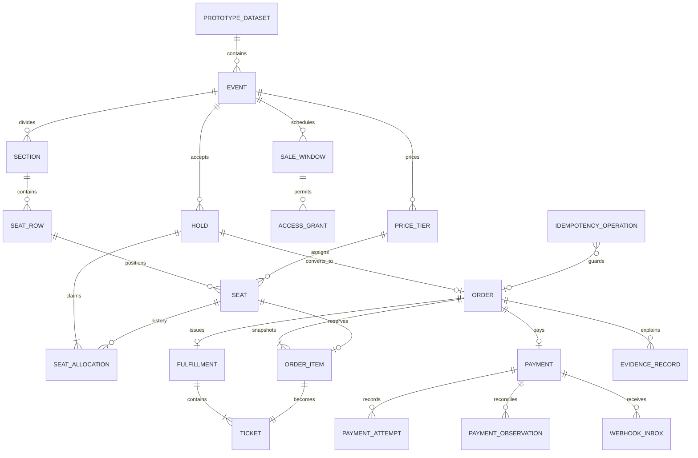

# ONSALE durable domain model

Status: design contract; deliberately not applied

Scope: prototype event inventory, checkout, reconciliation, and fulfillment

Baseline: `8dede8f296f2d74359e8d1e95734687e18c5a8e5`

Authority: server and Postgres; never the browser

## Decision summary

This model makes the smallest durable system that can truthfully inhabit the
Figma experience.

- V1 is **assigned seating**. The proscenium and six-by-ten seat map represent
  real seats. General-admission inventory is a future, separate inventory type;
  it is not simulated with seat records or contradictory copy.
- A buyer may hold **one to four seats**. The entire requested set is claimed or
  none is. Four is a merchant prototype policy, not a Hyperswitch capability
  claim.
- A hold owns a price snapshot. Price, fees, tax, total, and currency cannot
  change between the hold summary and payment. “All-in” may appear only when
  the displayed unit and order totals already include every component.
- One order has one stable Hyperswitch payment identity. Retries and connector
  attempts remain attempts beneath that identity; an uncertain result is
  retrieved before another mutating command is considered.
- A successful multi-seat order produces one fulfillment bundle and **one
  ticket per seat**. A single visual ticket may be a bundle cover, but it cannot
  masquerade as the only ticket for several seats.
- Browser return, action completion, and webhook receipt are signals, not proof
  of payment. Fulfillment requires a server-observed canonical success obtained
  from a verified webhook or same-payment retrieve.
- Reset does not erase or rewrite payment history. It creates a new prototype
  dataset generation and retires the old event from the active demo.

## Ownership boundary

| Concern | Authority | Browser responsibility |
| --- | --- | --- |
| Event, sale window, seat map, price | Postgres | Render a server snapshot |
| Access decision | Merchant policy record | Submit proof and render result |
| Seat availability and hold expiry | Postgres transaction time | Request, renew only if allowed, render expiry |
| Order amount and currency | Immutable order snapshots | Display exact server totals |
| Payment identity and attempts | Merchant server plus Hyperswitch retrieval | Mount official checkout and report return marker |
| Reconciliation | Merchant server | Poll/read status; never promote it |
| Fulfillment | Postgres transaction after reconciled success | Render issued ticket records |
| Evidence classification | Append-only evidence ledger | Explain observed versus merchant-owned versus unproven |

The client may keep transient presentation state such as the currently focused
seat. It may not invent inventory, extend a hold, calculate the amount charged,
choose a processor, declare success, or issue a ticket.

## Aggregate map



## Identity and shared conventions

- Internal identifiers are opaque UUIDv7 values. Public slugs and ticket
  references are separate, non-sequential values.
- Money is signed 64-bit integer minor units plus an ISO 4217 currency. V1
  orders are positive, single-currency USD. Floating-point money is forbidden.
- Time is stored as UTC `timestamptz`. Event-local display uses the event's IANA
  timezone. Expiry decisions use database time, not client time.
- Mutable aggregates carry an integer `version`. Commands use compare-and-swap
  semantics or row locks; last-write-wins is forbidden for inventory and money.
- Enumerated states are constrained text values initially rather than database
  enum types, keeping additive migrations and rollback practical.
- Business records are retained. `deleted_at` is not a substitute for releasing
  an allocation or canceling an order.

## Records

### `prototype_dataset`

Defines an isolated seed generation: `id`, `generation`, `label`, `state`
(`preparing | active | retired`), `seed_version`, `created_at`, `activated_at`,
and `retired_at`.

Exactly one generation may be active in a prototype environment. All seeded
event-owned records carry `dataset_id`; orders and evidence remain attached to
the generation in which they occurred.

### `event`

`id`, `dataset_id`, `slug`, `name`, `venue_name`, `venue_timezone`,
`starts_at`, `currency`, `seating_mode`, `state`, `inventory_version`, and
display-safe metadata.

- `seating_mode` is `assigned` for V1.
- `state` is `draft | on_sale | sales_paused | sold_out | ended | canceled`.
- `(dataset_id, slug)` is unique.
- A sale may be paused without rewriting existing holds, orders, or tickets.

### `sale_window` and `access_grant`

The Figma presale/general-sale hierarchy needs explicit merchant-domain state.

`sale_window` contains `event_id`, `kind` (`presale | general`), open/close
times, `access_policy_kind`, per-order seat limit, and state. A window must be
open in database time for a new hold.

`access_grant` contains a random subject/session reference, `sale_window_id`,
decision (`eligible | ineligible | expired | revoked`), policy version,
proof-kind metadata, and expiry. It stores neither full card number nor raw
proof. The Figma last-four interaction must be replaced by a real merchant
proof adapter or be labelled prototype policy evidence.

### `section`, `seat_row`, and `seat`

- `section`: `id`, `event_id`, name, ordinal, and accessible display metadata.
- `seat_row`: `id`, `section_id`, label, ordinal.
- `seat`: `id`, `row_id`, label, ordinal, `price_tier_id`, and lifecycle state
  (`sellable | blocked | removed`).

Uniqueness is structural: section ordinal within event, row ordinal within
section, and seat ordinal plus label within row. A seat's lifecycle state does
not contain transient availability. Current availability is derived from its
lifecycle state and active `seat_allocation`.

The baseline seed contract is six rows by ten seats. It must include at least
one contiguous group of four sellable, unallocated seats and enough additional
availability that repeated demos do not appear broken. Exact taken/blocked
distribution belongs to the versioned seed, not application code.

### `price_tier`

`id`, `event_id`, name, `face_value_minor`, `fee_minor`, `tax_minor`,
`all_in_minor`, currency, sale-window applicability, and effective interval.

Required arithmetic:

`all_in_minor = face_value_minor + fee_minor + tax_minor`

All values are non-negative and use the event currency. Editing a price tier
affects future holds only. A hold and order retain immutable copies of every
component, so a later tier edit cannot produce a bait-and-switch checkout.

### `hold`

The hold aggregate contains `id`, `event_id`, `sale_window_id`, optional
`access_grant_id`, random buyer-session reference, state, `expires_at`, version,
and creation/release/conversion timestamps.

State graph:

```text
active ──release──> released
active ──expiry───> expired
active ──convert──> converted
```

All three terminal states are immutable. An active hold has one to four active
allocations and an expiry in the future at commit time. V1 does not silently
renew holds. Any future extension command must be an explicit, idempotent
merchant policy with a hard maximum lifetime.

### `seat_allocation`

`id`, `event_id`, `seat_id`, `hold_id`, optional `order_id`, state
(`held | reserved | released | expired`), immutable price snapshot, and state
timestamps.

- A partial unique constraint permits at most one `held` or `reserved`
  allocation per seat.
- `held` requires an active, unexpired hold and no order.
- `reserved` requires exactly one order derived from that allocation's hold.
- Claiming one to four seats inserts every allocation in one transaction. A
  conflict rolls back the complete set.
- Expiry/release changes both the hold and all its held allocations in one
  transaction. A claimant may first reclaim an expired allocation while
  holding the relevant rows; time alone never creates two owners.
- Conversion changes allocations from `held` to `reserved`; it does not delete
  and recreate ownership.

### `order` and `order_item`

An order contains `id`, `event_id`, `hold_id`, `sale_window_id`, state,
currency, subtotal/fee/tax/total minor units, `payment_deadline_at`, version,
and timestamps.

An `order_item` contains `order_id`, exactly one `seat_id`, source
`seat_allocation_id`, seat/section/row display snapshots, price-tier name, and
all price components.

- One hold converts to at most one order; `hold_id` is unique.
- One seat appears at most once across non-canceled orders.
- The order's items are exactly the hold's active allocations at conversion.
- Orders contain one to four items; every item uses the same currency.
- Header totals equal the sum of item snapshots.
- Item identity and totals become immutable before a provider payment is
  created.
- V1 order state is:

```text
awaiting_payment -> payment_pending -> paid -> fulfilled
        |                  |
        +-> canceled       +-> canceled
```

`paid` means canonical provider success is reconciled locally. `fulfilled`
means the atomic fulfillment transaction completed. Expired holds cannot create
orders. Canceling an unpaid order releases its reservations only when no
external payment exists or same-payment retrieval proves a canonical state in
which no charge can still settle. An `action_required`, `processing`, or
`uncertain` payment blocks cancellation and seat release until reconciliation.
Paid seats are not released by a reset or browser abandonment. Refund and
ticket revocation are outside V1 rather than implied by local cancellation.

### `payment`

The payment aggregate contains `id`, unique `order_id`, adapter name,
merchant/reference ID, nullable unique provider payment ID, normalized state,
canonical provider status, amount/currency, provider creation operation ID,
last observation time, and version.

Normalized transition graph:

- `not_created -> requires_method | canceled`
- `requires_method -> action_required | processing | uncertain | exhausted |
  canceled`
- `action_required -> processing | requires_method | uncertain | exhausted |
  canceled`
- `processing -> succeeded | requires_method | uncertain | exhausted |
  canceled`
- `uncertain -> succeeded | requires_method | exhausted | canceled`, but only
  through reconciliation of the same payment identity
- `succeeded`, `canceled`, and `exhausted` are terminal

A failed connector attempt does not itself terminally fail the payment; the
merchant may return to `requires_method` or deliberately mark it `exhausted`.
Cancellation from an in-flight state requires a canonical provider observation;
a local deadline or browser exit is not sufficient.

Invariants:

- Payment amount/currency exactly equal immutable order total/currency.
- One order has one logical provider payment identity. A return, refresh,
  timeout, or manual retry never creates a second identity.
- `succeeded` can be entered only by a verified webhook observation or a server
  retrieve of the same provider payment ID.
- Unknown transport outcome moves to `uncertain`; the next provider operation
  is retrieve, not confirm or create.
- Terminal normalized states never regress from a stale webhook, return marker,
  or client snapshot.
- No durable record stores the provider client secret, redirect payload, PAN,
  CVC, connector credential, or hosted-action URL containing sensitive data.

### `payment_attempt`

An append-mostly record for each processor attempt beneath the stable payment:
`id`, `payment_id`, logical attempt number, provider attempt ID, connector
account reference, processor name, method family, normalized attempt state,
provider code/category, amount/currency, started/observed/finished timestamps,
and the observation that last changed it.

- `(payment_id, logical_attempt_number)` and non-null provider attempt ID are
  unique.
- Attempt states are `started | action_required | authorized | charged |
  failed | voided | unknown`; `charged`, `failed`, and `voided` are terminal.
- Processor/connector fields come from an observed API result. They are never
  randomly selected or inferred from a configured connector inventory.
- A new attempt is permitted only after the previous attempt is terminal or
  retrieval proves no charge. Routing/fallback policy remains separately
  gated.

### `payment_observation`

An append-only canonicalization input: source (`retrieve | verified_webhook |
browser_return | command_response`), provider status/version if available,
observed timestamp, sanitized field set, body digest, and whether the
observation was allowed to advance state.

State reduction is deterministic and order-independent: terminal success wins
over earlier uncertainty; browser return alone never advances to success; a
stale failure cannot overwrite success. Every rejected regression is retained
as evidence rather than discarded.

### `idempotency_operation`

Guards every externally repeatable command: `scope`, `operation_key`, command
kind, request hash, state (`started | external_pending | completed | failed`),
target aggregate references, provider-operation reference, sanitized result
reference, and timestamps.

- `(scope, operation_key)` is unique.
- Same key and same request hash returns the recorded result.
- Same key and different request hash returns a conflict and performs no work.
- Provider mutation uses a deterministic adapter operation identifier. The
  concrete Hyperswitch header/body mapping must be proven by an adapter test; it
  is not assumed here.
- A crash after provider acceptance but before local persistence leaves
  `external_pending`. Recovery reuses the same provider operation identifier or
  retrieves by the stable merchant/payment reference. It does not issue a new
  logical command.
- Read-only reconcile operations are safe to repeat and still receive operation
  receipts for traceability.

### `webhook_inbox`

The webhook boundary receives the raw request only in memory for signature
verification and parsing. Durable fields are `id`, provider, profile/merchant
scope, provider event ID when present, body digest, signature state,
normalized event kind, payment reference, sanitized normalized fields,
received/processed timestamps, processing state, and error category.

- Provider event ID is unique within provider/profile when supplied. Otherwise
  a versioned deterministic digest key deduplicates equivalent deliveries.
- An unverified webhook is quarantined and cannot mutate payment or order.
- Processing one inbox item, inserting its observation, reducing payment state,
  and scheduling/performing local fulfillment happens transactionally.
- Duplicate and out-of-order deliveries are acknowledged without duplicate
  attempts, charges, or tickets.
- Raw webhook bodies, signatures, credentials, and customer payment details are
  not written to logs, evidence JSON, or the database.

### `fulfillment` and `ticket`

`fulfillment` contains unique `order_id`, state (`pending | issued | failed`),
issued timestamp, item count, and failure category.

`ticket` contains `fulfillment_id`, unique `order_item_id`, unique `seat_id`,
public ticket reference, a hash of the redemption token, state
(`issued | voided | redeemed`), and issued timestamp.

- A fulfillment may begin only when order and payment are `paid`/`succeeded`.
- The fulfillment row, one ticket for every order item, and transition of order
  to `fulfilled` commit in a single database transaction.
- `item_count` equals both order item count and ticket count.
- The raw redemption token may be returned once to the authorized presentation
  boundary; only its hash is durable.
- A retry uses the unique order/order-item constraints and returns the existing
  ticket set. It cannot issue a second ticket.
- V1 does not implement refund/revocation. Those states require a separate
  lifecycle and provider proof before UI claims.

### `evidence_record`

An append-only, sanitized explanation record linked to event/order/payment/
attempt/fulfillment as applicable. Fields include `evidence_class`, source
kind, observed/recorded timestamp, sanitized summary JSON, content hash,
redaction-policy version, artifact reference, and optional `supersedes_id`.

Evidence classes are deliberately distinct:

- `observed_live`: dated result for this sandbox order/profile;
- `merchant_rule`: policy ONSALE owns, such as maximum four seats;
- `recorded_replay`: immutable replay of a prior observed trace;
- `simulation`: deterministic fixture, never presented as live;
- `unproven`: configured or theoretically possible, not observed.

Corrections append a superseding record. Evidence never stores API keys, client
secrets, payment credentials, raw redirects/webhooks, full customer identity,
or unredacted provider payloads. Processor logos are presentation assets, not
evidence of an attempted route.

## Transaction boundaries

### T1 — claim seats atomically

1. Validate active dataset, on-sale event, open sale window, access grant, and
   `1..min(4, sale_window.seat_limit)` distinct seats.
2. Begin transaction; lock the dataset/event/window and requested
   seat/allocation rows in stable seat-ID order.
3. Reclaim allocations whose holds are provably expired at database time.
4. Validate every seat is sellable, in the event/window, priced, and free.
5. Insert one hold and every allocation with price snapshots.
6. Commit once. Any conflict aborts all seats.

### T2 — release or expire a hold

Lock the hold, make terminal transition once, mark every held allocation
released/expired, and commit. Duplicate release/expiry returns the existing
terminal result.

### T3 — convert hold to order

Lock hold plus allocations; verify active and unexpired; insert the order and
one item per allocation; verify totals; transition allocations to reserved and
hold to converted; commit. Provider I/O is forbidden inside this transaction.

### T4 — create or confirm payment

1. In a short transaction, lock the order/payment operation, validate amount,
   and reserve the idempotency operation as `external_pending`.
2. Call Hyperswitch outside the database transaction using the stable merchant
   reference and adapter-proven deterministic operation identifier.
3. In a second transaction, persist the provider identity/observation and
   complete the operation.
4. If step 2 has an unknown result, persist `uncertain`; recovery retrieves the
   same identity before another mutation.

No database lock is held across network I/O.

### T5 — reconcile an observation

Lock payment/order, insert the deduplicated observation, apply the transition
reducer, normalize attempts, and, if newly succeeded, move order to `paid`.
Verified webhook inbox processing includes its inbox state in this transaction.
Browser-return observations can trigger retrieval but cannot directly pay.

### T6 — issue fulfillment exactly once

Lock succeeded payment and paid order; upsert fulfillment by unique order;
insert one ticket per order item using unique item/seat constraints; assert
counts; transition fulfillment and order; commit. Any failure rolls back all
tickets and the order transition.

T5 and T6 may run in one transaction after canonical success or as two
idempotent transactions. There must never be a committed `fulfilled` order with
missing tickets.

### T7 — cancel an unpaid order and release inventory

Lock order, payment, and every reserved allocation. If no external payment was
created, cancel directly. Otherwise require a same-payment canonical
observation proving `canceled` or `exhausted`; an in-flight or uncertain payment
blocks the operation. Transition order and allocations together. Duplicate
cancellation returns the existing terminal result.

## Cross-aggregate invariants

1. Every seat, price tier, hold, allocation, order, and ticket resolves to one
   event and one dataset generation.
2. A seat has at most one active owner (`held` or `reserved`).
3. A hold contains one to four distinct seats and is converted no more than
   once.
4. An order's seat set and price snapshots exactly equal its converted hold.
5. Price arithmetic is integer, non-negative, single-currency, and immutable
   before external payment creation.
6. One order has at most one logical payment and one provider payment ID.
7. Provider create/confirm commands are idempotent; unknown results reconcile
   before retry.
8. Client, browser-return, unverified webhook, and fixture evidence cannot
   produce `succeeded`.
9. A successful payment cannot regress, and a stale observation is recorded but
   not applied.
10. One successful order has one fulfillment, with exactly one ticket per order
    item and seat.
11. No transaction can leave a partial multi-seat hold or partial ticket set.
12. Reset/reseed cannot release a paid seat, delete audit evidence, or mutate an
    external Hyperswitch object.

## Prototype reset and reseed boundary

Reset is an administrative, non-production operation, not a buyer route.

1. Require an explicit non-production environment flag and an idempotency key.
2. Acquire an advisory lock for dataset rotation.
3. Build and validate a new `preparing` dataset, including the six-by-ten map,
   price tiers, sale windows, and at least one adjacent group of four available
   seats.
4. In one transaction, activate the new dataset and retire the previous active
   dataset.
5. Preserve old orders, attempts, webhook receipts, evidence, and tickets. They
   remain queryable by their dataset but disappear from the active buyer demo.
6. Never cancel, refund, delete, or recreate a Hyperswitch payment as part of
   reset.

The same reset operation key returns the same generation. Concurrent reset
calls cannot create two active generations. The command refuses to activate a
dataset that fails structural or price invariants.

## Migration and rollback plan

No step below is authorized by this document; it is the gate for later DDL.

### Phase A — contract before schema

1. Implement the repository/state-reducer interfaces against an ephemeral test
   Postgres instance.
2. Add every red test below and preserve its initial failure receipt.
3. Review table/constraint names and Hyperswitch adapter idempotency mapping.

### Phase B — additive schema

1. Add versioned migrations for dataset/event inventory, holds/allocations,
   orders/payments, inbox/evidence, and fulfillment in dependency order.
2. Use checks, foreign keys, unique/partial unique indexes, and transaction
   assertions for the invariants databases can enforce.
3. Record migration version and checksum. Never place secrets or live fixture
   payloads in migrations.

### Phase C — seed and shadow proof

1. Seed a new inactive dataset deterministically.
2. Run structural, price, contention, expiry, idempotency, reconciliation, and
   fulfillment tests against Neon in an isolated test namespace.
3. Read the new repository through a shadow adapter and compare sanitized
   snapshots with expected Figma states. Do not dual-write money or inventory.
4. Activate the dataset only after the complete gate passes.

### Phase D — cutover

1. Pause buyer writes, verify no `external_pending` operation is orphaned, and
   capture counts/checksums.
2. Switch the server repository feature flag to Postgres.
3. Run one non-charging hold/release smoke test, then the separately approved
   sandbox checkout path.
4. Keep the local fixture repository read-only for comparison; it is no longer
   an authority.

### Rollback

- Before external provider mutation: pause writes, return the feature flag to
  the read-only fixture demo, and retain the new schema for diagnosis. Drop only
  an unused isolated test namespace after a reviewed export.
- After any provider payment is created: do **not** switch authority back to a
  mutable local fixture and do not reverse or drop data. Pause checkout, revert
  application code to the last compatible database adapter, reconcile every
  pending payment, and keep Postgres authoritative.
- A down migration is allowed only for additive objects with zero durable
  business rows and no external side effects. Otherwise rollback is a forward
  repair migration.

## Red test matrix

These tests are written and observed failing before implementation. Each test
uses isolated datasets and stable operation IDs; fixtures are not human-outcome
evidence.

| ID | Red setup and operation | Required green assertion |
| --- | --- | --- |
| INV-01 | Two sessions concurrently request the same seat | Exactly one hold commits; the loser gets a typed conflict |
| INV-02 | Two sessions request overlapping four-seat bundles | One entire bundle wins; no partial allocation exists |
| INV-03 | Request zero, five, duplicate, blocked, or cross-event seats | Command rejects without creating a hold/allocation |
| INV-04 | Release the same active hold twice | First release frees all seats; second returns the same terminal result |
| INV-05 | Claim immediately before/after database-time expiry | No overlap; post-expiry claimant can atomically reclaim all requested seats |
| INV-06 | Hold expires while conversion races | Exactly one terminal result: converted order or expired/released inventory |
| INV-07 | Reseed a baseline dataset | Six-by-ten structure and at least four adjacent available seats validate |
| PRC-01 | Modify a price tier after hold creation | Hold/order snapshots and payable total remain unchanged |
| PRC-02 | Inject mismatched fee arithmetic or currency | Hold/order/payment creation rejects before provider I/O |
| ORD-01 | Convert one hold twice with duplicate/different operation keys | One order only; same request replays, conflicting request rejects |
| ORD-02 | Convert a multi-seat hold | One immutable order item per allocation; header totals equal item sums |
| PAY-01 | Create payment twice with the same operation key | One logical/provider identity and one recorded provider mutation |
| PAY-02 | Reuse an operation key with a different request hash | Conflict; no provider call and no state change |
| PAY-03 | Simulate timeout after provider acceptance | Payment becomes uncertain; recovery retrieves same reference, never creates anew |
| PAY-04 | Deliver browser return claiming success without retrieve/webhook | Payment and order do not advance to succeeded/paid |
| PAY-05 | Record a failed connector attempt with retry allowed | Attempt is terminal; logical payment may remain open, and no ticket exists |
| PAY-06 | Apply success then a stale failure/processing observation | Success remains canonical; stale input is retained but not applied |
| PAY-07 | Concurrent reconcile jobs observe the same success | One applied transition, one paid order, no duplicate attempt/charge row |
| PAY-08 | Try a new confirm while outcome is uncertain | Command blocks until same-payment retrieval resolves uncertainty |
| PAY-09 | Expire/cancel an order while payment is action-required, processing, or uncertain | Cancellation and seat release block until canonical no-charge reconciliation |
| WH-01 | Replay one verified webhook twice | One inbox effect and one observation/state transition |
| WH-02 | Submit an invalid-signature webhook | Quarantined receipt only; no payment/order/fulfillment mutation |
| WH-03 | Deliver out-of-order failed then succeeded then failed events | Deterministic final success with rejected regressions evidenced |
| FUL-01 | Run two fulfillment workers for one paid order | One fulfillment and exactly one ticket per order item |
| FUL-02 | Force ticket insertion failure on item N | Entire transaction rolls back; no ticket and order remains paid |
| FUL-03 | Fulfill a four-seat order | Four distinct tickets in one bundle; no single-seat masquerade |
| FUL-04 | Attempt fulfillment from action/processing/failed state | Reject with zero ticket writes |
| EVD-01 | Evidence sanitizer receives keys, PAN/CVC-like values, client secret, redirect, and PII | Forbidden fields are absent; content hash/redaction version remain |
| EVD-02 | Fixture or configured connector is labelled observed live | Classification validator rejects the claim |
| RST-01 | Run the same reseed operation concurrently | One new active generation; old generation retired once |
| RST-02 | Reset after a paid four-seat order | New inventory appears; old order/payment/evidence/tickets remain unchanged |
| RST-03 | Activate a malformed or understocked seed | Reset aborts; prior dataset remains the only active generation |
| TXN-01 | Kill the process between provider call and local completion | Operation remains recoverable by stable reference/idempotency; no second payment |
| TXN-02 | Kill the process during multi-seat claim or ticket issuance | Database shows all-or-nothing state after recovery |

## Gate to implementation

DDL and the Postgres runtime adapter remain blocked until:

1. the state/repository interfaces and transition reducer are reviewed;
2. the adapter-specific Hyperswitch idempotency mechanism is observed rather
   than assumed;
3. the red matrix is executable with preserved red receipts;
4. migration and rollback commands are dry-run in an isolated namespace;
5. the Figma server snapshot can represent event, access, seats, hold, order,
   payment, attempts, evidence, and fulfillment independently.

This model does not authorize UI edits, live routing mutation, webhook
configuration, Neon DDL, or deployment.
