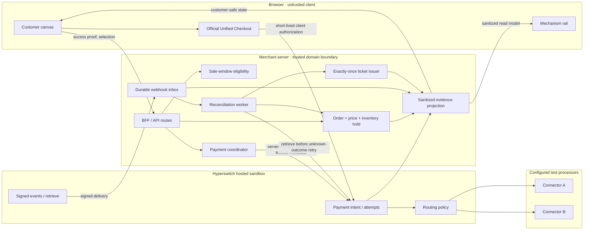
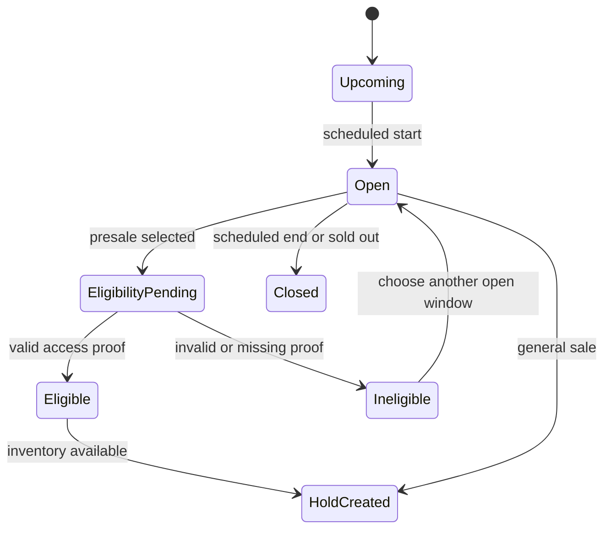
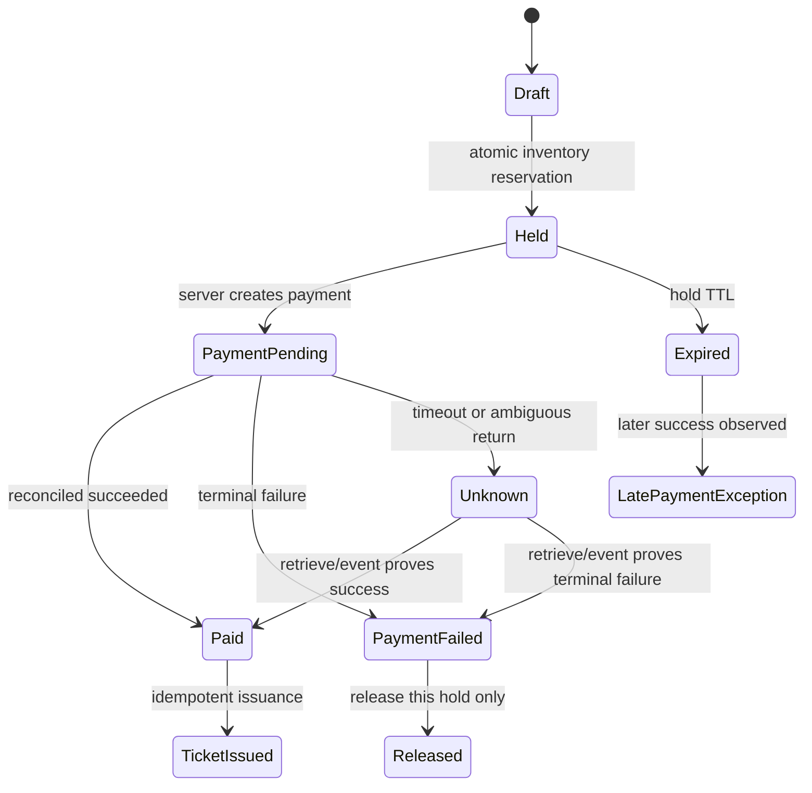
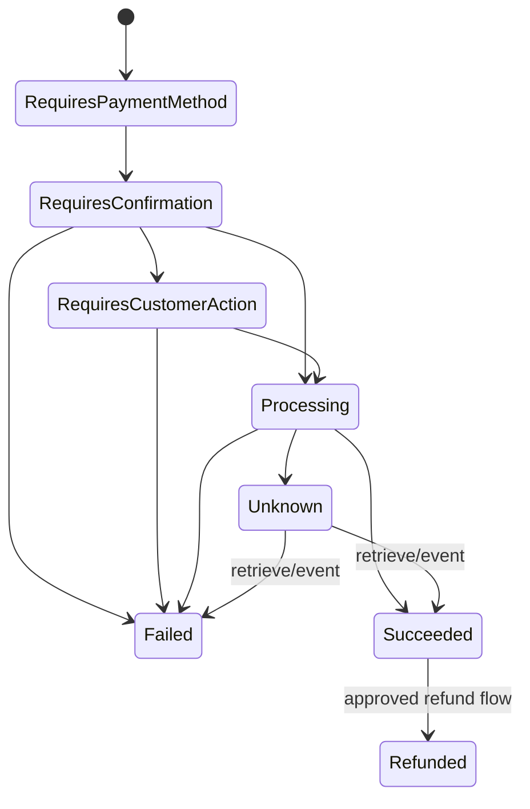
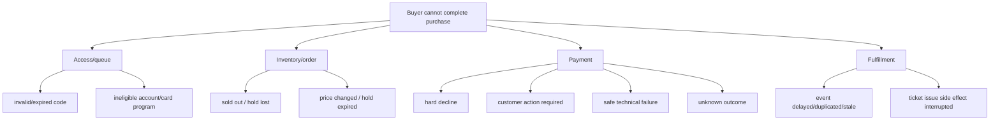

# Design contract — Onsale Control Room

Status: structural proposal for review, not visual design approval  
Version: 0.1  
Build authorized: **no**

## 1. Experience sentence

A buyer completes one high-demand ticket purchase without leaving the event
surface, while a reviewer can see the active payment policy, route, attempts,
events, final money state, and ticket effect unfold on the same page.

The interface is not a dashboard next to a fake storefront. Both panes are two
views of one causal object: the same `order_id` and `payment_id`.

## 2. Fixed interaction direction

The direction is now fixed by Prithvi:

- **left:** the normal customer journey;
- **right:** the Hyperswitch mechanism and explanation;
- **same route/page:** no navigation to a separate engineering dashboard during
  the flow;
- **challenge/redirect:** appears as an overlay anchored to the same experience;
- **high craft:** one event is allowed, but all meaningful states, responsive
  layouts, accessibility behavior, and transitions must be finished.

### Desktop structure

```text
┌──────────────────────────────────────────────────────────────────────────────┐
│ Event / sale-window status / evidence mode                                  │
├───────────────────────────────────────────────────┬──────────────────────────┤
│ CUSTOMER CANVAS · approximately 72%              │ MECHANISM RAIL · 28%     │
│                                                   │                          │
│ Event → tickets → eligibility → checkout          │ Active policy            │
│ → pending/challenge → result → ticket             │ Inputs + matched rule    │
│                                                   │ Route + attempt ledger   │
│ Customer copy stays domain-first                  │ Events + money position  │
│                                                   │ Ticket transition        │
├───────────────────────────────────────────────────┴──────────────────────────┤
│ Evidence status: LIVE HOSTED / LOCAL FAULT / DATED RECORDING / UNPROVEN     │
└──────────────────────────────────────────────────────────────────────────────┘
```

At desktop widths the working target is 72/28, adjustable after the first
real-content render. It is not a rigid pixel ratio.

### Narrow layouts

The same-page rule remains. At 768px, use a compact 62/38 split if the official
checkout remains usable; otherwise the right rail becomes a pinned side sheet.
At 360px, the customer flow remains primary and the mechanism becomes a
persistent, keyboard-accessible bottom sheet with live status summary. Opening
it does not navigate or reset checkout. “Responsive” must never mean rendering
an unreadable desktop split at mobile width.

Required proof widths: **360, 768, 1280, and 1920px**. Add 320/390 checks where
the existing eval contract requires them; the stricter set wins.

## 3. What the prototype is—and is not

### It is

- a fictional, production-shaped US ticketing onsale;
- one event with staged sale windows and a scarce inventory hold;
- an official Hyperswitch React checkout inside an authored domain shell;
- a control-room explanation of real hosted evidence where available;
- a proof of state safety, explainability, and reversible policy.

### It is not

- a claim that Hyperswitch solves bots, queues, or inventory;
- a copy of Ticketmaster, Eventbrite, a real artist, Citi, Cash App, or Visa;
- a statistical authorization-rate or cost experiment;
- a raw-card form;
- a gallery of every Hyperswitch feature;
- a simulated failover presented as hosted behavior.

## 4. Information architecture

### Customer canvas

| State group | Essential content | Customer action | Right-rail response |
|---|---|---|---|
| Event | art direction, artist/event name, venue/date, all-in price, sale window | Choose ticket/seat | Shows no payment yet; policy preview only |
| Eligibility | presale status, access proof, eligible payment constraint | Verify access or choose general sale | Shows trusted/untrusted inputs and access boundary |
| Hold | chosen ticket, quantity, total, hold countdown | Continue / release | Shows `order_id`, inventory state, server price |
| Checkout | official Unified Checkout, accepted method explanation | Pay | Shows payment created, active policy, no PAN/CVC |
| Action required | challenge/redirect overlay or pending | Complete / resume | Shows provider state and why action is required |
| Recoverable failure | clear status and preserved order/hold | Wait, change method, or safe retry as policy allows | Shows failure class and whether retry is allowed |
| Hard decline | respectful explanation and next step | Choose another eligible method or exit | Shows **no automatic cascade** receipt |
| Success | ticket, receipt, event details, final amount | View ticket / inspect receipt | Shows one success, one ticket, terminal state |
| Exception | hold expired plus late success or unresolved state | Contact/reconciliation path | Shows explicit exception, never false success |

### Mechanism rail

The rail has five stable layers so it does not reorder itself during the demo:

1. **Policy** — name, version, status, activated time, rollback baseline.
2. **Decision** — sanitized inputs, matched condition, selected connector, reason.
3. **Attempts** — attempt number, connector, start/end, provider/unified status,
   failure class, retry eligibility.
4. **State** — provider payment state, canonical order state, money position,
   inventory hold, ticket state.
5. **Evidence** — event/retrieve sources, timestamps, evidence class, expandable
   sanitized payload fields.

The customer never has to read this rail to finish. The rail never contains a
control that can accidentally mutate payment state during an explanatory demo;
operator actions live in an explicitly entered setup mode.

## 5. System architecture and trust boundaries



### Boundary rules

- The browser may request a selection; the server recomputes price and inventory.
- Access codes/account-link proofs are verified by the merchant access service.
- The server authors routing metadata. The client cannot choose a processor.
- PAN/CVC stay within the official checkout boundary and never enter merchant
  logs, persistence, evidence, screenshots, or client state.
- The API key and connector/webhook secrets remain server-side secret-store
  values.
- A return URL or client callback is a hint, not final payment evidence.
- Ticket issuance requires reconciled server/provider success and an idempotent
  domain transition.

## 6. Domain and payment state machines

### Sale window and access



### Inventory/order



### Payment evidence

Retain the provider status verbatim and map it to a smaller domain state. Do not
erase attempt-level evidence.



Illegal transitions and stale events are recorded and ignored/rejected, never
quietly coerced.

## 7. Presale policy and routing matrix

Access policy and processor routing are separate layers.

| Case | Merchant access result | Payment evidence | Routing behavior | Customer result |
|---|---|---|---|---|
| Cardmember presale + valid access + eligible test network | eligible | official checkout identifies supported network | deterministic priority A → B | proceed; B only on approved safe technical failure |
| Cardmember presale + valid access + wrong network | eligible for window but wrong tender | network does not match | do not manufacture a route; reject before charge or request eligible card | clear “use an eligible card” state |
| Cardmember presale + invalid access | ineligible | no payment created | no routing | return to sale-window choice |
| Partner-wallet presale | eligible via merchant proof | method availability depends on hosted support | separate explicit rule only if supported | no card-rule reuse |
| General onsale | no sponsor entitlement required | supported card | default/priority B (or recorded baseline) | normal checkout |
| Any window + hard issuer decline | eligibility unchanged | hard decline | no blind cross-connector cascade | honest decline and next action |
| Any window + technical retryable failure | eligibility unchanged | classified safe technical failure | at most one approved fallback in first proof | context preserved; one final charge max |
| Any window + unknown outcome | eligibility unchanged | timeout/response loss | retrieve/reconcile before new attempt | honest pending/resume |

### Candidate rule artifact

```text
name: onsale-cardmember-v01
condition:
  trusted_metadata.sale_window == "cardmember_presale"
  AND card_network == "<eligible sandbox network>"
selection:
  priority: [connector_a, connector_b]
fallback/default:
  [connector_b]
```

This is a proposal until the current API schema, connectors, test cards, and
hosted evaluator confirm it. A 60/40 rule may be tested separately for correct
distribution configuration, but no performance conclusion is allowed from a
small sandbox batch.

## 8. API and component contract

Exact route names are implementation proposals; external Hyperswitch endpoints
must be revalidated against current official docs.

| Merchant surface | Responsibility | Idempotency / security |
|---|---|---|
| `POST /api/access/verify` | validate sale-window proof | rate-limited; no raw card data |
| `POST /api/orders` | recompute price and atomically hold ticket | deterministic order key; server price |
| `POST /api/orders/:id/payment` | create/reuse one Hyperswitch payment | operation key scoped to order/create |
| `GET /api/orders/:id` | customer-safe resumed state | never trusts client success |
| `GET /api/orders/:id/trace` | sanitized mechanism projection | read-only; secret/PCI allowlist |
| `POST /api/webhooks/hyperswitch` | verify and durably record event | signature before mutation; event dedupe |
| `POST /api/orders/:id/refund` | approved bounded refund | separate refund operation key |

Suggested modules:

```text
app/
  customer/             event, eligibility, hold, checkout, result
  mechanism/            policy, decision, attempts, state, evidence
  overlays/             3DS/redirect/pending continuity
server/
  access/               presale proof and trusted sale-window context
  orders/               price, hold, order state
  payments/             Hyperswitch adapter and retrieve/reconcile
  webhooks/             signature, inbox, ordering, handlers
  fulfillment/          exactly-once ticket issue/revoke
  evidence/             sanitized projections and manifests
evals/
  model/ faults/ hosted/ browser/ claims/ hci/
```

## 9. Failure tree and UI behavior



Every error surface must name the domain, current truth, customer consequence,
and next safe action. The right rail adds the technical cause and evidence
class. It must never say “Hyperswitch recovered this” when the event is produced
by a local fault adapter or recording.

## 10. Causal motion contract

| Motion | Meaning | Constraint |
|---|---|---|
| Policy condition highlights, then route line activates | causality | triggers only after server decision evidence arrives |
| Attempt card moves from active to terminal | state | never loops indefinitely; status text is primary |
| State token flows from payment to ticket | continuity | only after reconciled success; no premature celebration |
| Challenge overlay enters/exits | continuity | focus trapped/restored; browser back/refresh safe |
| Retry connector line activates | causality | shows failure classification before second attempt |
| Rollback diff collapses to baseline | state/control | setup mode only; exact config IDs visible |

All motion has a reduced-motion equivalent. Color is never the only status
signal. Durations/easing and visual style wait for Prithvi's design materials and
the G-design review.

## 11. Flows Gallery contract

| Flow | Live target | Recorded/local fallback | Key proof |
|---|---|---|---|
| F1 Cardmember successful onsale | one real hosted sandbox success | dated success recording if service unavailable during review | eligible policy → route → success → one ticket |
| F2 Safe technical recovery | live only if two connectors and failure induction are supported | clearly labeled local fault adapter | two attempts, one payment, one successful charge |
| F3 Hard decline | supported hosted test failure | local documented fixture | no unsafe cascade, no ticket |
| F4 Challenge/pending/resume | hosted if supported connector/test card exists | local state fixture | same order resumes, no duplicate payment |
| F5 Duplicate/out-of-order event | local deterministic replay; hosted redelivery if supported | deterministic event harness | one ticket, no state regression |
| F6 Refund/cancellation | hosted refund if approved | local domain fixture | bounded refund and explicit ticket state |

Each entry must include: sourced problem, flow diagram, live/recorded label,
“do this / notice that,” trace, limitation, and last-verified timestamp.

## 12. Visual steering gate

Before visual implementation, Prithvi reviews:

1. this structural contract;
2. a grayscale 360/768/1280/1920 wireframe with real content density;
3. the right-rail information hierarchy;
4. one interaction prototype for success, retry, and challenge overlay;
5. the proposed design references and whether Blend components/tokens are used;
6. the supplied images/Figma source and privacy/access boundary.

The build must not invent a full visual language before this gate. Structural
and state-machine work can proceed after G-build; styling waits for G-design.

## 13. Design acceptance tests

- Buyer completes core flow without opening the mechanism rail.
- Reviewer can answer route, retry, charge-count, money-state, and ticket-state
  questions from the rail without facilitator coaching.
- Focus, status announcements, and overlay return work by keyboard.
- No checkout reset when the mechanism sheet opens or viewport changes.
- No clipped primary action or unreadable trace at 360/768/1280/1920.
- No serious/critical automated accessibility findings; human/AT limitations are
  disclosed.
- Every animation has state/causality/continuity purpose or is removed.
- Every visible evidence item is `LIVE HOSTED`, `LOCAL FAULT`, `DATED
  RECORDING`, or `UNPROVEN`.
- One event looks intentional and complete, not like a developer fixture.

## 14. Decision receipt

- **Chosen:** same-page customer canvas plus mechanism rail, with high state
  depth and official checkout.
- **Rejected:** separate dashboard navigation, a thin one-ticket mock, raw card
  fields, and an animated routing diagram detached from real evidence.
- **Deciding fact:** the assignment must teach why Hyperswitch matters while a
  real buyer flow remains coherent.
- **Pending human input:** visual language, design files, content tone, and final
  event art direction.
